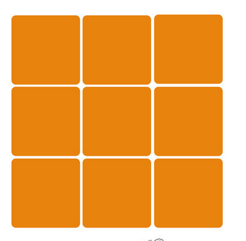
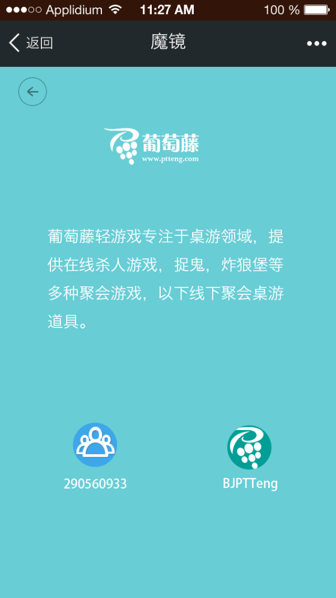
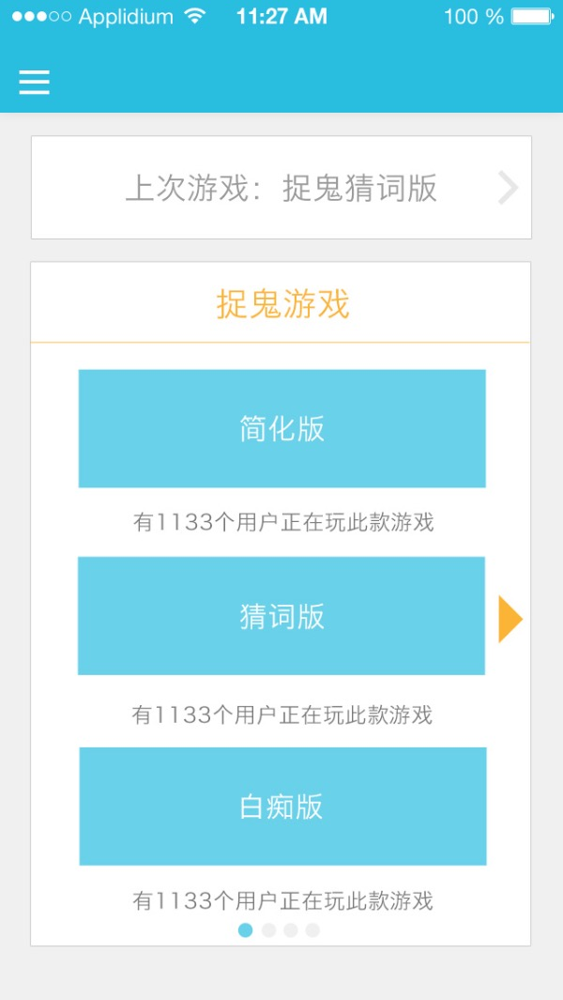
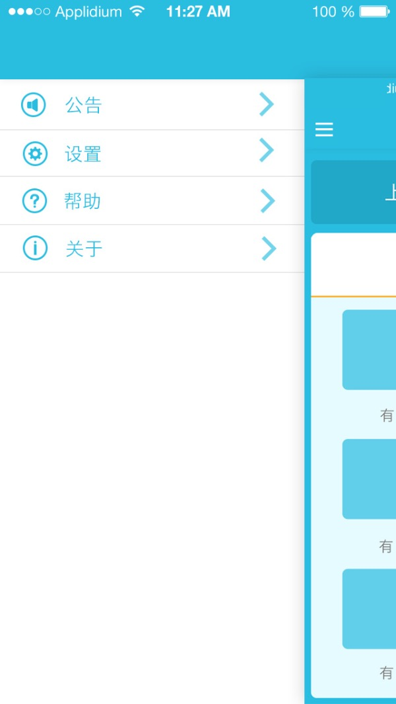
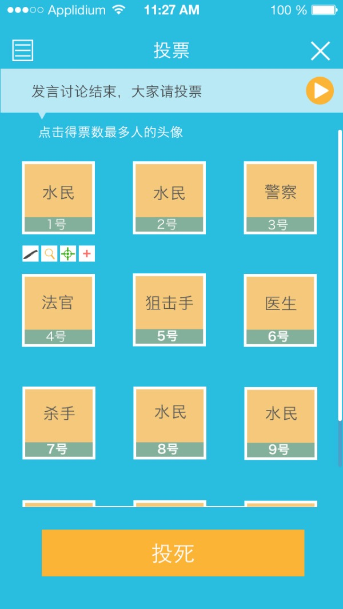
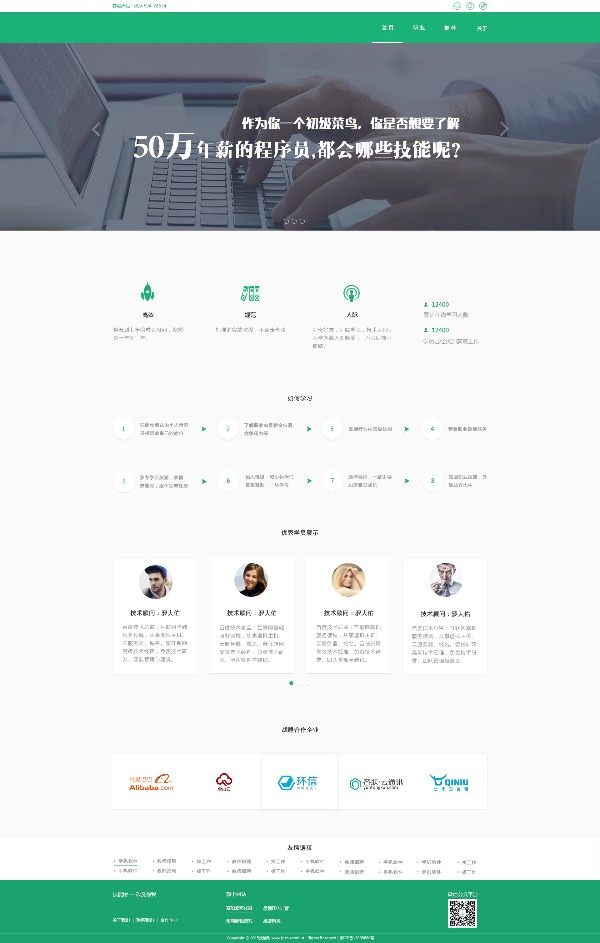
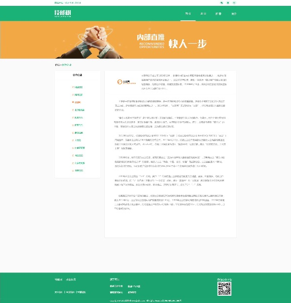
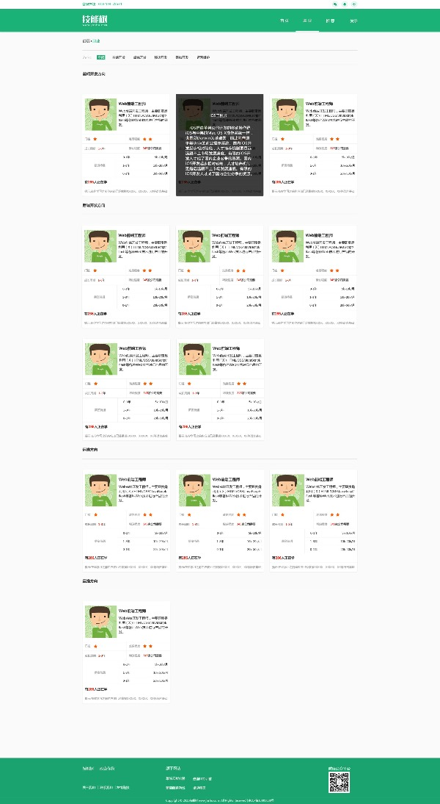

## [IT修真院] WEB官方Task【CSS篇】

###本仓库是IT修真院CSS课程的任务代码，一共有15个TASK，如下：

####Task的整体设置如下：

* 1~3 搭建基础环境，学会Nginx，WebStorm，Svn/git,linux Shell，dns/dnspod
* 4~6 学会和UI的交互，学会切图和制作雪碧图，了解如何从静态图片变成静态网页的过程，掌握一些基本的切图技巧和布局知识，布局，定位，浮动等。
* 7~9 掌握常见的WEB布局和一些常见的CSS效果
* 10~12 学会自适应和响应式，熟悉长度单位，以及更多的Html控件
* 13~15 使用less和Bootstrap

###我的Demo:
* [task01](http://jaywii.github.io/private/ITX/CSSTASK/task01/task01.html)
* [task03](http://jaywii.github.io/private/ITX/CSSTASK/task03/task03.html)
* [task04](http://jaywii.github.io/private/ITX/CSSTASK/task04/task04.html)
* [task05](http://jaywii.github.io/private/ITX/CSSTASK/task05/task05.html)

###Task  1

####目标：
完成一个九宫格布局。

####意义：
Nginx是前端必备法器，修练的走早，越熟悉。Div布局原理是入门基础理论。兼容性是通过F12调试。这三者是学习和修炼CSS的基础，无论CSS的能力怎么样，基础环境的搭建始终都是第一步。

###Task 2

####目标：
代码上传到SVN或Git，成功CheckOut，并部署到Linux服务器，可以直接通过域名或IP访问。
####意义：
Git或者是SVN，是团队合作的利器，提前学会团队协作，更是开启了阅读他人源码来自我学习的途径。云服务器是现代开团Team必备的内容，Linux也是前端人员必备的技能之一。
          域名并不是什么特别神奇的东西，通过这项任务，将自己亲手搭建的项目直接了当的在互联网上展现出来，这就是前端的魅力。
          
###Task 3

####目标：
完成一个桌游精灵的投票页的游戏布局。

####意义：
团队协作中，和UI的交互是必不可少的，切图也是前端人员最常见的技能。

###Task 4
####目标：
完成一个桌游精灵的游戏结果页的布局。

####意义：
小图标的切图，文字排版，以及很常见的浮动按钮。

####要求：
1.兼容IE8以上的浏览器
2.命名规范，图片路径存放规范
3.支持手机自适应                                                                         4.上传到自己的服务器上，可以在线访问
5.底部的按钮位置固定

###Task 5
####目标：
做出手机网站常见的导航菜单。

####意义：
简单的CSS动画，简单的JS基础

####要求：
1.兼容IE8以上的浏览器
2.命名规范，图片路径存放规范
3.支持手机自适应
4.上传到自己的服务器上，可以在线访问
5.点击左侧的菜单可以滑出导航菜单，再次点击可以关闭
6.在页面底部引入JS文件

###Task 6
####目标：
用雪碧图加载小图标，播放声音文件

####意义：
了解初步的性能优化方式，了解多媒体的使用

####要求：
1.使用雪碧图 可以用原始方法，也可以用框架
2.命名规范，图片路径存放规范
3.支持手机自适应
4.上传到自己的服务器上，可以在线访问
5.点击播放按钮，可以播放Mp3

###Task 7
####目标： 
完成IT修真院的首页

####意义：
掌握网页规范，页面结构【头部，导航，内容，底部】等等
####要求：
* 1.和UI图完全一致，不允许出现1象素的偏差
* 2.命名规范，图片路径存放规范
* 3.上传到自己的服务器上，可以在线访问
* 4.兼容IE10以上各种浏览器， 不同分辨下不会出现各种横向滚动条和变形，暂不要求支持自适应。
* 5.Banner图可以轮播
* 6.通过F12查看各个文件的下载耗时，整个页面加载时间不允许超过2秒

###Task 8
####目标： 
完成IT修真院的职位列表页

####意义：
熟悉卡片式的网站布局和简单的鼠标划过的CSS效果

###Task 9
####目标： 
完成IT修真院的职位列表页

####意义：
熟悉卡片式的网站布局和简单的鼠标划过的CSS效果

###Task 10

####目标：
重写Task7以支持响应式和自适应，支持PAD和手机。
####意义：
响应式的写法

###Task 11

####目标：
重写Task8以支持响应式和自适应，支持PAD和手机。
####意义：
响应式的写法

###Task 12

####目标：
重写Task9以支持响应式和自适应，支持PAD和手机。
####意义：
响应式的写法

###Task 13

####目标：
用Bootstrap和Less重写Task7以支持响应式和自适应，支持PAD和手机。
####意义：
响应式的写法

###Task 14

####目标：
用Bootstrap和Less重写Task8以支持响应式和自适应，支持PAD和手机。
####意义：
响应式的写法

###Task 15

####目标：
用Bootstrap和Less重写Task9以支持响应式和自适应，支持PAD和手机。
####意义：
响应式的写法